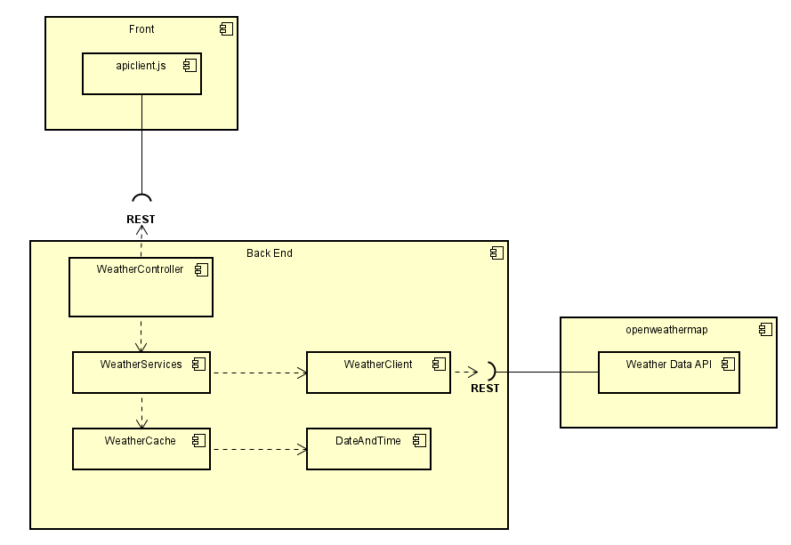
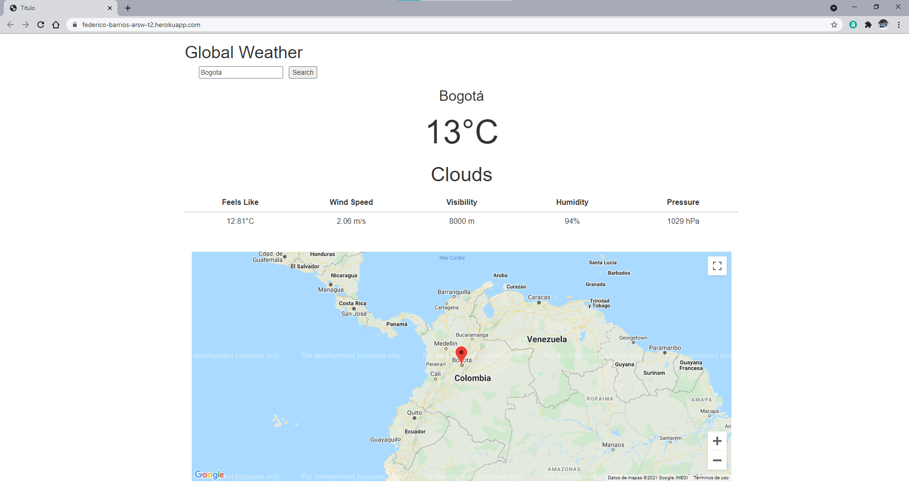

# Escuela Colombiana de Ingeniería Julio Garavito - Arquitecturas de Software ARSW - Parcial Segundo Tercio

Realizado por Federico Barrios Meneses.
## Diseño de arquitectura


## Funcionamiento de la aplicación
Se debe ingresar el nombre de la ciudad en el campo de texto y luego oprimir el botón search:


## Ejecución local de la aplicación
Para ejecutar localmente el programa debe clonar el repocitorio de GitHub con el siguiente comando:
```
git clone https://github.com/federico29/federico-barrios-arsw-t2
```
Luego se debe compilar ejecutando una consola de comandos en el directorio de la aplicación y escribiendo el siguiente comando:
```
mvn package
```
Luego dirigirse al directorio /target y abrir el archivo parcial-0.0.1-SNAPSHOT.jar. Luego abrir el siguiente enlace: http://localhost:8080

O también puede ejecutar el siguiente comando en el directorio de la aplicación y abrir el enlace http://localhost:8080:
```
mvn spring-boot:run
```
## ¿Cómo se puede extender la aplicación?
Dentro de la aplicación pueden extenderse varias funcionalidades, por ejemplo, se puede crear un menu que permita elegir las unidades con las que se quiere visualizar la información, cambiando de unidades métricas a unidades imperiales, etc.
## URL Heroku
[](https://federico-barrios-arsw-t2.herokuapp.com/)

Url: https://federico-barrios-arsw-t2.herokuapp.com/

